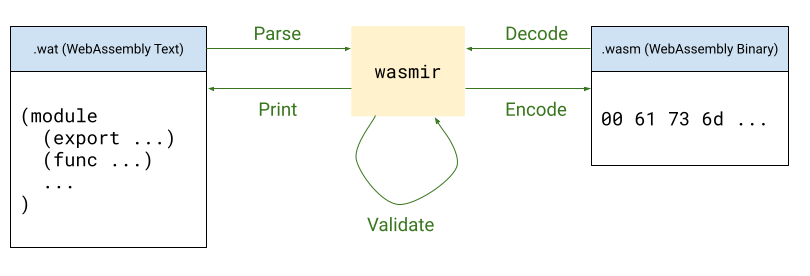

# watgo

[](https://github.com/eliben/watgo/actions/workflows/ci.yml)
[](https://pkg.go.dev/github.com/eliben/watgo)

----

<p align="center">
  
</p>

**W**eb**A**ssembly **T**oolkit for **Go** (**watgo**) to parse [WASM](https://www.w3.org/TR/wasm-core-2/) text or decode WASM binary into internal data
structures, allowing conversions, etc.

### WASM feature support and proposals

Initially, we aim to support all the [finished proposals](https://github.com/WebAssembly/proposals/blob/main/finished-proposals.md)
without any flags or feature selection. Finished proposals are part of the WASM
spec.

If there's a request to support [active proposals](https://github.com/webassembly/proposals),
we'll consider employing explicit feature flags to gate this support.

### Installation

To install the CLI into your Go bin directory:

```sh
go install github.com/eliben/watgo/cmd/watgo@latest
```

To run it directly from a checkout without installing:

```sh
go run ./cmd/watgo
```

To run it straight from the module path without installing:

```sh
go run github.com/eliben/watgo/cmd/watgo@latest
```

### Go API

The public Go API is documented on [`pkg.go.dev`](https://pkg.go.dev/github.com/eliben/watgo),
including runnable examples for the high-level functions in `package watgo`.

<p align="center">
  
</p>

### CLI

`watgo` currently provides basic `parse`, `print`, and `validate` subcommands.

For supported subcommands and flags, the CLI aims to stay compatible with
[`wasm-tools`](https://github.com/bytecodealliance/wasm-tools).

Examples:

```sh
# Compile WAT text to a WASM binary file.
watgo parse input.wat -o output.wasm

# Validate a WAT file.
watgo validate input.wat

# Validate a WASM binary.
watgo validate input.wasm

# Read WAT from stdin and write WASM to stdout.
cat input.wat | watgo parse > output.wasm
```

For full command-line help, run:

```sh
watgo help
```

### Testing

Run the full test suite with:

```sh
go test ./...
```

Some of the end-to-end tests execute compiled modules under Node.js, so Node is
required for the full suite.

For more detail on the different test sets and how to refresh them from
upstream, see [`tests/README.md`](tests/README.md).

### License

The source code of watgo is in [the public domain](LICENSE). Certain vendored
test scripts retain their original licenses:

- `tests/wasmspec`
  
  * Source: https://github.com/WebAssembly/spec/
  * License: Apache License 2.0
  * See: `tests/wasmspec/LICENSE`

- `tests/wabt-interp`
  
  * Source: https://github.com/WebAssembly/wabt
  * License: Apache License 2.0
  * See: `tests/wabt-interp/LICENSE`
